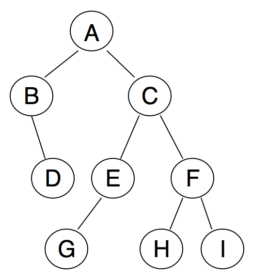
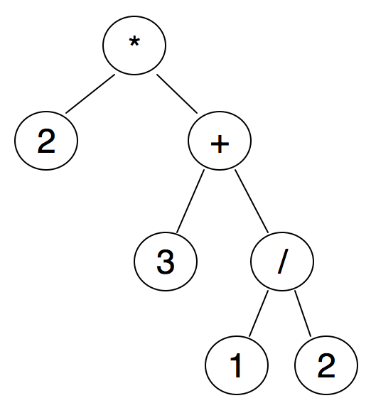

# Activity Sheet 10

Manager
  ~ name:

Recorder
  ~ name:

Speaker
  ~ name:

### Section 5.3

1. Carry out the three different traversals in the following tree:

    {width=30% height=20%}

    \newpage

2. In this exercise we consider trees corresponding to algebraic expressions. The idea is that each binary operator is represented by a node, whose children are the two operands. For example the expression `2 * (3 + 1/2)` would be represented via the tree in the figure.

    {width=30% height=20%}

    a. Create a similar tree for the expression `3 + (1 / (4 + 5))`
    \vfill
    b. If we wanted to evaluate the expression by traversing the tree, which of the three traversals would we follow?
    \vfill
    \newpage
